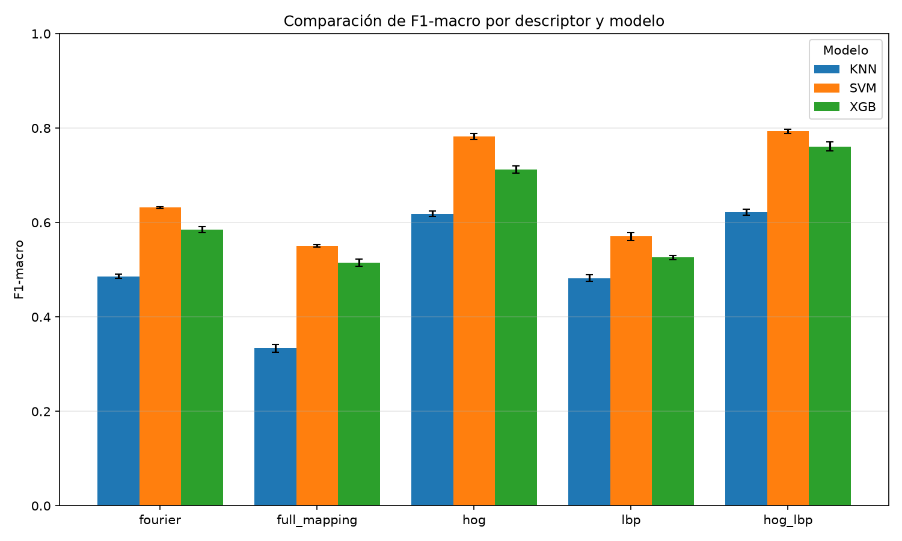
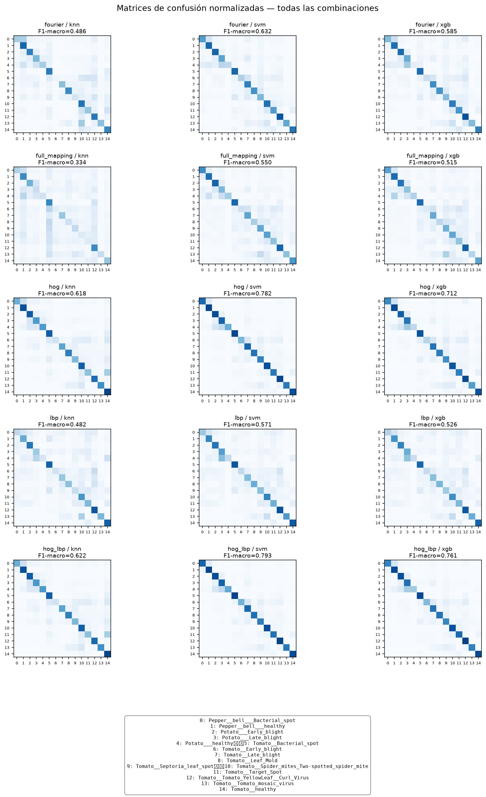

# CV_U2_plant-disease

Pipeline de **visión por computador clásica** para la detección y clasificación de enfermedades en hojas utilizando el dataset **PlantVillage**.

Este proyecto fue desarrollado como parte de la evaluación de la **Unidad 2** del curso **CS5362 – Visión por Computador** de la Universidad de Ingeniería y Tecnología (UTEC).

## Objetivo

El objetivo del proyecto es estudiar cómo distintas etapas de procesamiento de imágenes influyen en la clasificación de patologías foliares.

El pipeline incluye:

1. Preprocesamiento de imágenes
2. Segmentación de la hoja
3. Operaciones morfológicas
4. Detección de bordes
5. Detección de esquinas
6. Extracción de características
7. Clasificación

## Dataset

Se utiliza el dataset **PlantVillage**, compuesto por imágenes de hojas individuales clasificadas según especie y condición.

En este trabajo se utilizaron **20 638 imágenes** distribuidas en **15 clases** correspondientes a:

- **Pimiento (Pepper bell)**
  - Bacterial spot
  - Healthy
- **Papa (Potato)**
  - Early blight
  - Late blight
  - Healthy
- **Tomate (Tomato)**
  - Bacterial spot
  - Early blight
  - Late blight
  - Leaf Mold
  - Septoria leaf spot
  - Spider mites
  - Target Spot
  - Tomato Yellow Leaf Curl Virus
  - Tomato mosaic virus
  - Healthy

> El dataset no se incluye directamente en este repositorio debido a su tamaño.

## Metodología

### 1. Preprocesamiento

Se aplica un filtro Gaussiano de `3 x 3` para reducir ruido y suavizar pequeñas variaciones del fondo.

La conversión a escala de grises se utiliza únicamente en las etapas que lo requieren, como Canny, HOG, LBP y ORB.

### 2. Segmentación de la hoja

La segmentación utiliza el método de **Otsu** de manera independiente sobre:

- Canal **A** del espacio de color **CIE-LAB** (invertido)
- Canal **S** del espacio de color **HSV**

Las máscaras se combinan mediante una operación lógica **OR**.

### 3. Operaciones morfológicas

Para refinar la máscara segmentada se aplican:

- **Erosión:** kernel `3 x 3`
- **Dilatación:** kernel `10 x 10`

Estas operaciones reducen ruido y permiten cerrar cavidades internas generadas por necrosis o decoloración.

### 4. Detección de bordes

Se utiliza el detector **Canny** con umbrales:

```text
(70, 100)
```

Esto permite identificar tanto el contorno externo de la hoja como discontinuidades internas relacionadas con nervaduras y lesiones.

### 5. Detección de esquinas

Se comparan dos métodos:

- **Harris**
- **Shi-Tomasi**

Los puntos se restringen a la región segmentada de la hoja para evitar detecciones en el fondo.

### 6. Extracción de características

Se evaluaron cuatro descriptores individuales y una combinación:

#### Local Binary Patterns (LBP)

- Radio: `R = 1`
- Vecinos: `P = 8`
- Histograma: `59 bins`

Captura información de microtextura.

#### Histogram of Oriented Gradients (HOG)

- `9` orientaciones
- Celdas de `32 x 32`
- Bloques de `2 x 2`

Representa gradientes, contornos y estructura espacial.

#### Bag of Visual Words (BoW / ORB)

- Hasta `500` descriptores ORB por imagen
- Vocabulario visual de `256` palabras
- Agrupamiento con `MiniBatchKMeans`

#### Descriptor radial de Fourier

Descriptor propuesto por el grupo.

La imagen se divide en celdas de `16 x 16` píxeles y se calcula una transformada de Fourier 2D por celda. La energía espectral se resume mediante `8` bandas radiales.

#### HOG + LBP

Se realiza una fusión temprana mediante concatenación directa de ambos vectores.

## Clasificadores

Cada representación fue evaluada utilizando:

- **K-Nearest Neighbors (KNN)**
- **Support Vector Machine (SVM)** con kernel RBF
- **XGBoost**

## Evaluación

Se utilizó **validación cruzada estratificada de 5 folds** (`StratifiedKFold`) con:

```text
random_state = 42
```

Las métricas principales fueron:

- Accuracy
- F1-score macro
- F1-score por clase
- Matriz de confusión

## Resultados principales

El mejor rendimiento global se obtuvo utilizando **HOG + LBP con SVM-RBF**:

| Descriptor | Clasificador | F1-macro | Accuracy |
|---|---|---:|---:|
| HOG + LBP | SVM-RBF | **0.793 ± 0.005** | **0.823 ± 0.004** |

Entre los descriptores individuales, **HOG** obtuvo el mejor rendimiento:

| Descriptor | Clasificador | F1-macro | Accuracy |
|---|---|---:|---:|
| HOG | SVM-RBF | **0.782 ± 0.006** | **0.812 ± 0.005** |

El descriptor radial de Fourier propuesto alcanzó un F1-macro de **0.632** con SVM, superando a LBP en esa configuración.

## Visualización de resultados

### Comparación de F1-macro



### Matrices de confusión



## Estructura del repositorio

```text
CV_U2_plant-disease/
├── new_notebook.ipynb
├── Operations.py
├── PreprocessingPipeline.py
├── class_mappings.txt
├── tabla_resumen_final.csv
├── results_summary.pkl
├── f1_comparison.png
├── confusion_matrices_grid.png
└── README.md
```

### Archivos principales

- `new_notebook.ipynb`: notebook principal de experimentación.
- `PreprocessingPipeline.py`: implementación del pipeline de preprocesamiento y segmentación.
- `Operations.py`: funciones auxiliares de procesamiento de imágenes.
- `tabla_resumen_final.csv`: resumen de resultados experimentales.
- `f1_comparison.png`: comparación gráfica del F1-macro.
- `confusion_matrices_grid.png`: matrices de confusión de las configuraciones evaluadas.

## Requisitos

El proyecto fue implementado en Python utilizando principalmente:

- Python
- NumPy
- OpenCV
- Matplotlib
- scikit-image
- scikit-learn
- XGBoost
- SciPy
- Joblib

Para trabajar con el dataset desde Kaggle también puede ser necesario:

- `kaggle`
- `kagglehub`

Una instalación típica puede realizarse con:

```bash
pip install numpy opencv-python matplotlib scikit-image scikit-learn xgboost scipy joblib kaggle kagglehub
```

## Ejecución

La experimentación completa se encuentra en:

```text
new_notebook.ipynb
```

Se recomienda ejecutarlo en orden para reproducir:

1. Carga y preparación del dataset
2. Segmentación y operaciones morfológicas
3. Detección de bordes y esquinas
4. Extracción de características
5. Entrenamiento de clasificadores
6. Validación cruzada
7. Generación de métricas y visualizaciones

## Autores

Proyecto desarrollado por:

- Thiago Frias Pinto
- Chiara Olenka Lazaro Condor
- Angel Obed Mora Huamanchay
- Juan Diego Prochazka Zegarra
- Mishelle Stephany Villarreal Falcón

**Universidad de Ingeniería y Tecnología (UTEC)**  
**Curso:** CS5362 – Visión por Computador  
**Ciclo académico:** 2026-2

## Repositorio

https://github.com/MishelleVF/CV_U2_plant-disease
